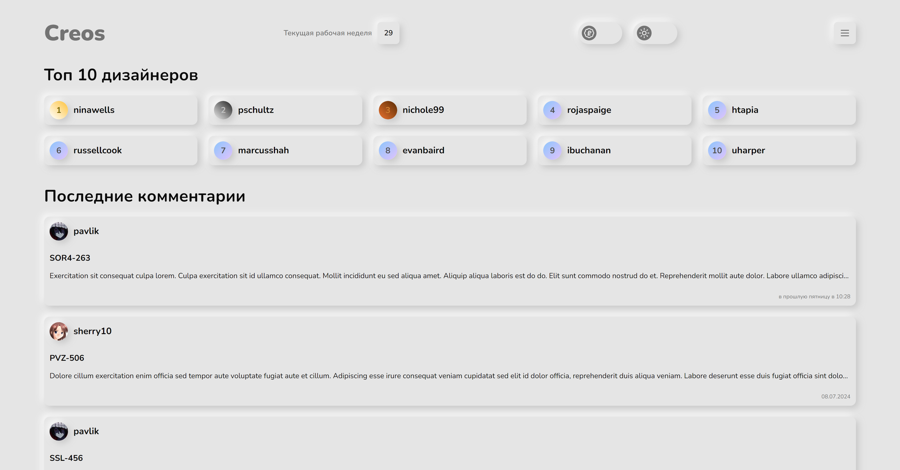
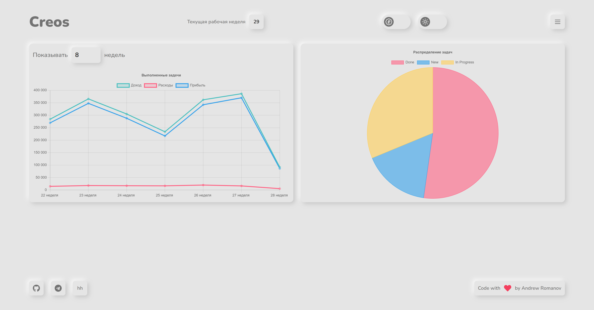
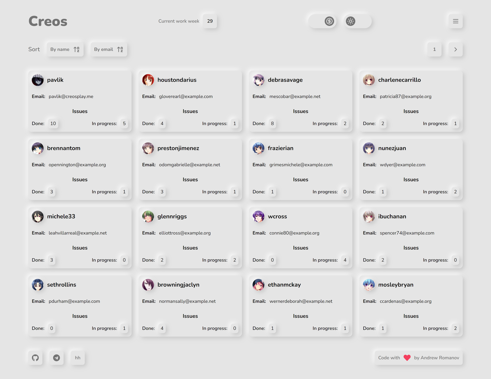
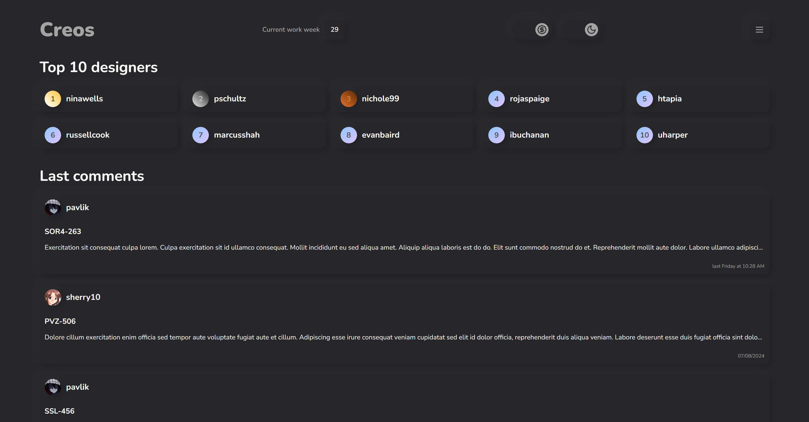
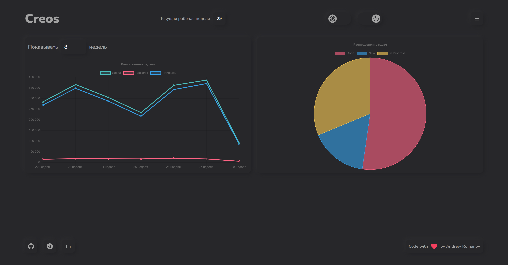
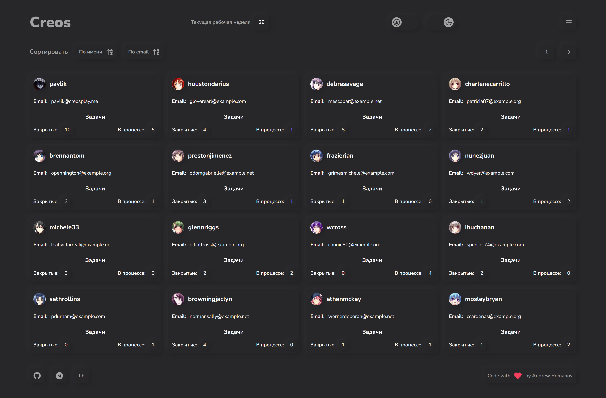

# Creos CRM - Frontend test

## Resources

- Next.js 14
- TypeScript
- Tailwind CSS
- Framer motion
- shadcn/ui
- Chart.js
- date-fns
- i18next
- Lucide
- React icons

## Getting Started

- Clone repository and `cd` into it
- Install the dependencies and run the dev server

```bash
npm i
npm run dev
```

Open [http://localhost:3000](http://localhost:3000) with your browser to see the result.

## Screenshots

Light theme







Dark theme







### Live Demo

[Click]()
